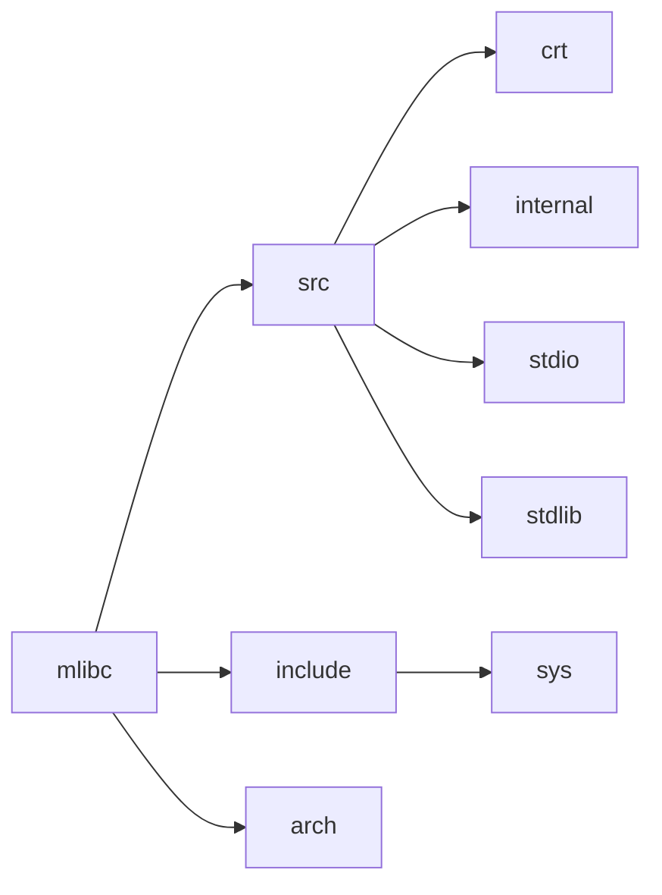
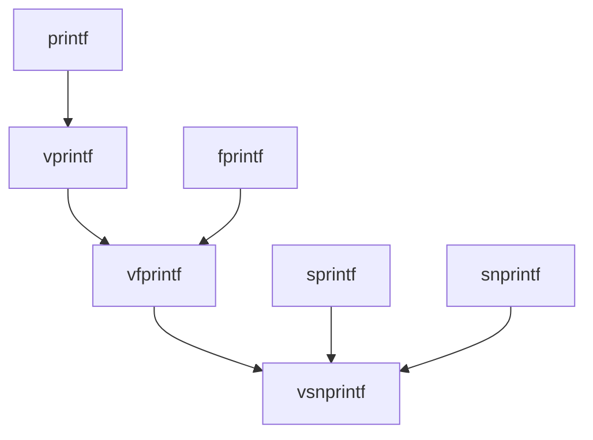

[TOC]

## 模块架构图

## 模块介绍

### 1. src

src目录中有三种类型的文件

- crt：存放c库的运行时初始化源文件
- internal：存放内部一些工具函数的头文件
- 存放其它标准函数的实现的源文件

### 2. include

include目录中有三种类型的文件

- sys：存放系统相关及系统调用接口相关的头文件
- include（当前目录）：存放对外开放的接口，如stdio.h

> 注：generic存放各个硬件架构通用的一些文件

### 3. arch

存放不同架构对于一些硬件/系统相关接口的实现或者是对于一些函数的优化

## mlibc支持的功能

### 格式化输入输出

| 函数                                                    | 功能描述                                              |
| ------------------------------------------------------- | ----------------------------------------------------- |
| `int printf(const char *, ...);`                        | 格式化输出到标准输出                                  |
| `void perror(const char *);`                            | 打印错误信息（未实现）                                |
| `int scanf(const char *, ...);`                         | 从标准输入读取格式化输入**（未实现）**                |
| `int snprintf(char *, size_t, const char *, ...);`      | 格式化输出到字符串，带大小限制                        |
| `int sprintf(char *, const char *, ...);`               | 格式化输出到字符串                                    |
| `int sscanf(const char *, const char *, ...);`          | 从字符串读取格式化输入**（未实现）**                  |
| `int vfprintf(FILE *, const char *, va_list);`          | 格式化输出到文件流，使用`va_list`                     |
| `int vfscanf(FILE *, const char *, va_list);`           | 从文件流读取格式化输入，使用`va_list`**（未实现）**   |
| `int vprintf(const char *, va_list);`                   | 格式化输出到标准输出，使用`va_list`                   |
| `int vscanf(const char *, va_list);`                    | 从标准输入读取格式化输入，使用`va_list`**（未实现）** |
| `int vsnprintf(char *, size_t, const char *, va_list);` | 格式化输出到字符串，使用`va_list`并带大小限制         |
| `int vsprintf(char *, const char *, va_list);`          | 格式化输出到字符串，使用`va_list`                     |
| `int vsscanf(const char *, const char *, va_list);`     | 从字符串读取格式化输入，使用`va_list`**（未实现）**   |

#### printf家族关系表

### 文件读写操作

| 函数                                                   | 功能描述                                             |
| ------------------------------------------------------ | ---------------------------------------------------- |
| `int feof(FILE *);`                                    | 检查文件结束符**（未实现）**                         |
| `int ferror(FILE *);`                                  | 检查文件错误标志**（未实现）**                       |
| `int fflush(FILE *);`                                  | 刷新文件流                                           |
| `int fgetc(FILE *);`                                   | 从文件流读取一个字符                                 |
| `char *fgets(char *, int, FILE *);`                    | 从文件流读取一行**（未实现）**                       |
| `int fileno(FILE *);`                                  | 获取文件流的文件描述符**（未实现）**                 |
| `void flockfile(FILE *);`                              | 锁定文件流**（未实现）**                             |
| `int fprintf(FILE *, const char *, ...);`              | 格式化输出到文件流                                   |
| `int fputc(int, FILE *);`                              | 向文件流写入一个字符                                 |
| `int fputs(const char *, FILE *);`                     | 向文件流写入一个字符串                               |
| `size_t fread(void *, size_t, size_t, FILE *);`        | 从文件流读取数据块                                   |
| `size_t fwrite(const void *, size_t, size_t, FILE *);` | 向文件流写入数据块                                   |
| `int ftrylockfile(FILE *);`                            | 尝试锁定文件流**（未实现）**                         |
| `void funlockfile(FILE *);`                            | 解锁文件流**（未实现）**                             |
| `int getc(FILE *);`                                    | 从文件流读取一个字符                                 |
| `int getc_unlocked(FILE *);`                           | 从文件流读取一个字符（非锁定）                       |
| `int getchar(void);`                                   | 从标准输入读取一个字符                               |
| `int getchar_unlocked(void);`                          | 从标准输入读取一个字符（非锁定）                     |
| `char *gets(char *);`                                  | 从标准输入读取一行（不推荐使用，存在缓冲区溢出风险） |
| `int putc(int, FILE *);`                               | 向文件流写入一个字符                                 |
| `int putc_unlocked(int, FILE *);`                      | 向文件流写入一个字符（非锁定）                       |
| `int putchar(int);`                                    | 向标准输出写入一个字符                               |
| `int putchar_unlocked(int);`                           | 向标准输出写入一个字符（非锁定）                     |
| `int puts(const char *);`                              | 向标准输出写入一个字符串并换行                       |
| `int ungetc(int, FILE *);`                             | 将字符放回到文件流**（未实现）**                     |

### 动态内存分配

| 函数                                     | 功能描述                                                     |
| ---------------------------------------- | ------------------------------------------------------------ |
| `void *malloc(size_t size);`             | 分配指定大小的内存块                                         |
| `void *calloc(size_t num, size_t size);` | 分配指定数量的元素，每个元素大小为`size`的内存块，并初始化为零 |
| `void *realloc(void *ptr, size_t size);` | 调整之前分配的内存块的大小                                   |
| `void free(void *ptr);`                  | 释放之前分配的内存块                                         |

### 内存操作函数

| 函数                                                        | 功能描述                                              |
| ----------------------------------------------------------- | ----------------------------------------------------- |
| `void *memset(void *s, int c, size_t count);`               | 将内存块的前`count`个字节设置为指定值`c`              |
| `void *memcpy(void *dst, const void *src, size_t count);`   | 将`count`个字节从源地址`src`复制到目标地址`dst`       |
| `int memcmp(const void *cs, const void *ct, size_t count);` | 比较两个内存块的前`count`个字节                       |
| `void *memmove(void *d, const void *s, size_t n);`          | 将`n`个字节从源地址`s`移动到目标地址`d`，处理重叠情况 |
| `void *memchr(const void *m, int c, size_t n);`             | 在前`n`个字节的内存块中搜索值`c`                      |

### 字符串操作函数

| 函数                                                         | 功能描述                                                     |
| ------------------------------------------------------------ | ------------------------------------------------------------ |
| `size_t strlen(const char *s);`                              | 计算字符串的长度，不包括终止符                               |
| `int strcmp(const char *cs, const char *ct);`                | 比较两个字符串                                               |
| `int strncmp(const char *cs, const char *ct, size_t count);` | 比较字符串的前`count`个字符                                  |
| `char *strcpy(char *d, const char *s);`                      | 将字符串`s`复制到目标`d`                                     |
| `char *strncpy(char *dst, const char *src, size_t n);`       | 将源字符串`src`的前`n`个字符复制到目标`dst`                  |
| `char *strcat(char *dest, const char *src);`                 | 将字符串`src`附加到`dest`的末尾                              |
| `char *strncat(char *dest, const char *src, size_t count);`  | 将源字符串`src`的前`count`个字符附加到目标`dest`的末尾       |
| `char *strrchr(const char *s, int c);`                       | 在字符串`s`中搜索最后一次出现的字符`c`                       |
| `char *strchr(const char *str, int c);`                      | 在字符串`str`中搜索第一次出现的字符`c`                       |
| `char *__strchrnul(const char *s, int c);`                   | 在字符串`s`中搜索第一次出现的字符`c`，如果未找到，返回指向终止符的位置 |
| `char *strstr(const char *string, const char *substring);`   | 在字符串`string`中搜索第一次出现的子字符串`substring`        |
| `char *strrev(char *str);`                                   | 反转字符串                                                   |
| `size_t strcspn(const char *s, const char *c);`              | 计算字符串`s`中第一个包含在字符串`c`中的字符的索引           |
| `char *strtok_r(char *s, const char *delim, char **last);`   | 分割字符串（线程安全）                                       |
| `char *strtok(char *s, const char *delim);`                  | 分割字符串（非线程安全）                                     |
| `char *strpbrk(const char *s1, const char *s2);`             | 在字符串`s1`中搜索第一个包含在字符串`s2`中的字符             |
| `size_t strspn(const char *s, const char *group);`           | 计算字符串`s`中连续包含在字符串`group`中的字符的长度         |
| `size_t strxfrm(char *dest, const char *src, size_t n);`     | 按照当前区域设置将`src`转换为一个可比较的形式，并复制到`dest`**（未实现）** |

### 时间处理函数

**TODO**
