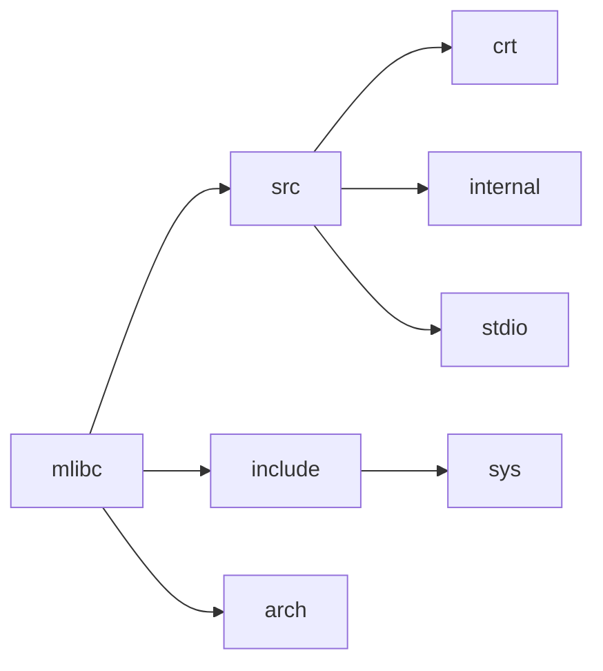

## 模块架构图

## 模块介绍

### 1. src

src目录中有三种类型的文件

- crt：存放c库的运行时初始化源文件
- internal：存放内部一些工具函数的头文件
- 存放其它标准函数的实现的源文件

### 2. include

include目录中有三种类型的文件

- sys：存放系统相关及系统调用接口相关的头文件
- include（当前目录）：存放对外开放的接口，如stdio.h

> 注：generic存放各个硬件架构通用的一些文件

### 3. arch

存放不同架构对于一些硬件/系统相关接口的实现或者是对于一些函数的优化

## 系统调用接口

### 内存管理接口

- malloc
- free
- realloc
- calloc

### 文件I/O接口

- open
- read
- write
- close
