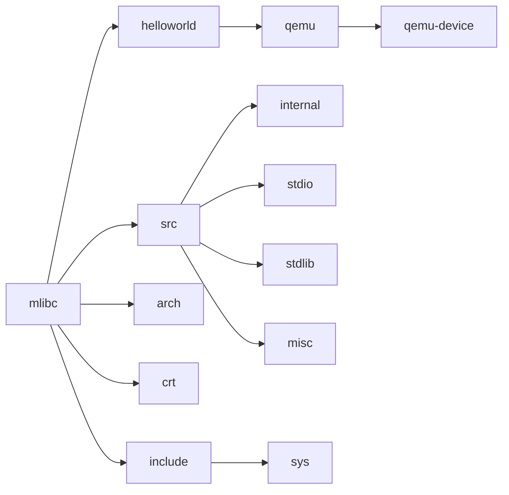
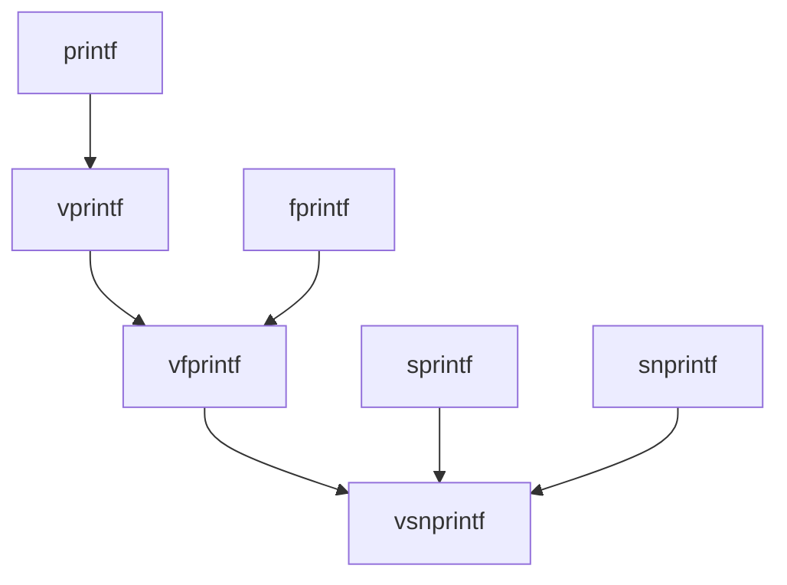

[TOC]

## File structure

## Module Overview

### 1. src

- **src/internal:** Contains header files related to internal implementations. These header files are not exposed externally.
- **src/module:** Contains source files implementing various standard functions.

### 2. include

- **include/sys:** Contains header files related to the system and system call interfaces.
- **include (current directory):** Contains public-facing interface headers, such as `stdio.h`.

### 3. arch

Contains implementations of hardware/system-related interfaces or optimizations for different architectures.

### 4. crt

Startup code for various architectures.

### 5. helloworld

## Features Supported by mlibc

### Formatted Input and Output

| Function                                                | Description                                                  |
| ------------------------------------------------------- | ------------------------------------------------------------ |
| `int printf(const char *, ...);`                        | Formats and prints output to the standard output.            |
| `void perror(const char *);`                            | Prints error messages (**Not Implemented**)                  |
| `int scanf(const char *, ...);`                         | Reads formatted input from standard input (**Not Implemented**) |
| `int snprintf(char *, size_t, const char *, ...);`      | Formats and prints output to a string with size limit.       |
| `int sprintf(char *, const char *, ...);`               | Formats and prints output to a string.                       |
| `int sscanf(const char *, const char *, ...);`          | Reads formatted input from a string (**Not Implemented**)    |
| `int vfprintf(FILE *, const char *, va_list);`          | Formats and prints output to a file stream using `va_list`.  |
| `int vfscanf(FILE *, const char *, va_list);`           | Reads formatted input from a file stream using `va_list` (**Not Implemented**) |
| `int vprintf(const char *, va_list);`                   | Formats and prints output to the standard output using `va_list`. |
| `int vscanf(const char *, va_list);`                    | Reads formatted input from standard input using `va_list` (**Not Implemented**) |
| `int vsnprintf(char *, size_t, const char *, va_list);` | Formats and prints output to a string using `va_list` with size limit. |
| `int vsprintf(char *, const char *, va_list);`          | Formats and prints output to a string using `va_list`.       |
| `int vsscanf(const char *, const char *, va_list);`     | Reads formatted input from a string using `va_list` (**Not Implemented**) |

#### Relationship Diagram for `printf` Family

### File I/O Operations

| Function                                               | Description                                                  |
| ------------------------------------------------------ | ------------------------------------------------------------ |
| `int feof(FILE *);`                                    | Checks for the end-of-file indicator (**Not Implemented**)   |
| `int ferror(FILE *);`                                  | Checks for a file error indicator (**Not Implemented**)      |
| `int fflush(FILE *);`                                  | Flushes a file stream.                                       |
| `int fgetc(FILE *);`                                   | Reads a character from a file stream.                        |
| `char *fgets(char *, int, FILE *);`                    | Reads a line from a file stream (**Not Implemented**)        |
| `int fileno(FILE *);`                                  | Gets the file descriptor of a file stream (**Not Implemented**) |
| `void flockfile(FILE *);`                              | Locks a file stream (**Not Implemented**)                    |
| `int fprintf(FILE *, const char *, ...);`              | Formats and writes output to a file stream.                  |
| `int fputc(int, FILE *);`                              | Writes a character to a file stream.                         |
| `int fputs(const char *, FILE *);`                     | Writes a string to a file stream.                            |
| `size_t fread(void *, size_t, size_t, FILE *);`        | Reads blocks of data from a file stream.                     |
| `size_t fwrite(const void *, size_t, size_t, FILE *);` | Writes blocks of data to a file stream.                      |
| `int ftrylockfile(FILE *);`                            | Attempts to lock a file stream (**Not Implemented**)         |
| `void funlockfile(FILE *);`                            | Unlocks a file stream (**Not Implemented**)                  |
| `int getc(FILE *);`                                    | Reads a character from a file stream.                        |
| `int getc_unlocked(FILE *);`                           | Reads a character from a file stream (unlocked).             |
| `int getchar(void);`                                   | Reads a character from standard input.                       |
| `int getchar_unlocked(void);`                          | Reads a character from standard input (unlocked).            |
| `char *gets(char *);`                                  | Reads a line from standard input (not recommended due to buffer overflow risk). |
| `int putc(int, FILE *);`                               | Writes a character to a file stream.                         |
| `int putc_unlocked(int, FILE *);`                      | Writes a character to a file stream (unlocked).              |
| `int putchar(int);`                                    | Writes a character to standard output.                       |
| `int putchar_unlocked(int);`                           | Writes a character to standard output (unlocked).            |
| `int puts(const char *);`                              | Writes a string to standard output and appends a newline.    |
| `int ungetc(int, FILE *);`                             | Pushes a character back to a file stream (**Not Implemented**) |

### Dynamic Memory Allocation

| Function                                 | Description                                                  |
| ---------------------------------------- | ------------------------------------------------------------ |
| `void *malloc(size_t size);`             | Allocates a block of memory of the specified size.           |
| `void *calloc(size_t num, size_t size);` | Allocates memory for an array of `num` elements of `size` each and initializes them to zero. |
| `void *realloc(void *ptr, size_t size);` | Resizes a previously allocated memory block.                 |
| `void free(void *ptr);`                  | Frees a previously allocated memory block.                   |

### Memory Manipulation Functions

| Function                                                    | Description                                                  |
| ----------------------------------------------------------- | ------------------------------------------------------------ |
| `void *memset(void *s, int c, size_t count);`               | Sets the first `count` bytes of the memory block to the specified value `c`. |
| `void *memcpy(void *dst, const void *src, size_t count);`   | Copies `count` bytes from the source address `src` to the destination address `dst`. |
| `int memcmp(const void *cs, const void *ct, size_t count);` | Compares the first `count` bytes of two memory blocks.       |
| `void *memmove(void *d, const void *s, size_t n);`          | Moves `n` bytes from the source address `s` to the destination address `d`, handling overlapping regions. |
| `void *memchr(const void *m, int c, size_t n);`             | Searches for the value `c` in the first `n` bytes of the memory block. |

### String Manipulation Functions

| Function                                                     | Description                                                  |
| ------------------------------------------------------------ | ------------------------------------------------------------ |
| `size_t strlen(const char *s);`                              | Calculates the length of a string, excluding the null terminator. |
| `int strcmp(const char *cs, const char *ct);`                | Compares two strings.                                        |
| `int strncmp(const char *cs, const char *ct, size_t count);` | Compares the first `count` characters of two strings.        |
| `char *strcpy(char *d, const char *s);`                      | Copies the string `s` to the destination `d`.                |
| `char *strncpy(char *dst, const char *src, size_t n);`       | Copies the first `n` characters of the source string `src` to the destination `dst`. |
| `char *strcat(char *dest, const char *src);`                 | Appends the string `src` to the end of `dest`.               |
| `char *strncat(char *dest, const char *src, size_t count);`  | Appends the first `count` characters of the source string `src` to the end of `dest`. |
| `char *strrchr(const char *s, int c);`                       | Searches for the last occurrence of the character `c` in the string `s`. |
| `char *strchr(const char *str, int c);`                      | Searches for the first occurrence of the character `c` in the string `str`. |
| `char *__strchrnul(const char *s, int c);`                   | Searches for the first occurrence of the character `c` in the string `s`; if not found, returns a pointer to the null terminator. |
| `char *strstr(const char *string, const char *substring);`   | Searches for the first occurrence of the substring `substring` in the string `string`. |
| `char *strrev(char *str);`                                   | Reverses a string.                                           |
| `size_t strcspn(const char *s, const char *c);`              | Calculates the index of the first character in `s` that is contained in `c`. |
| `char *strtok_r(char *s, const char *delim, char **last);`   | Splits a string into tokens (thread-safe).                   |
| `char *strtok(char *s, const char *delim);`                  | Splits a string into tokens (not thread-safe).               |
| `char *strpbrk(const char *s1, const char *s2);`             | Searches for the first character in `s1` that is also in `s2`. |
| `size_t strspn(const char *s, const char *group);`           | Calculates the length of the initial segment of `s` that consists only of characters in `group`. |
| `size_t strxfrm(char *dest, const char *src, size_t n);`     | Transforms the string `src` into a form that can be compared and copies it to `dest` based on the current locale (**Not Implemented**). |

### Time Handling Functions

**TODO**