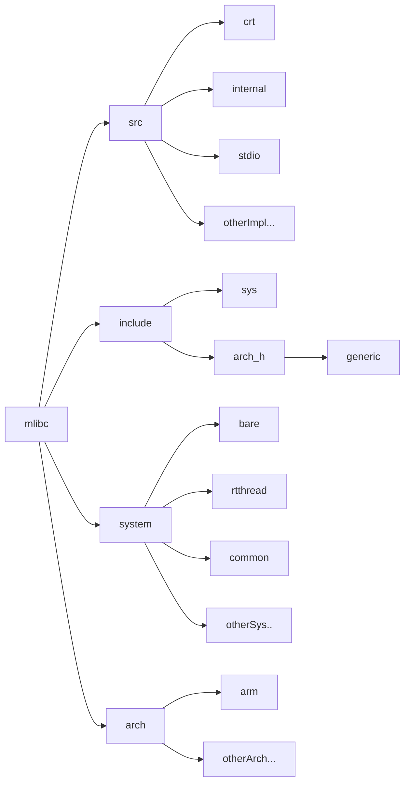
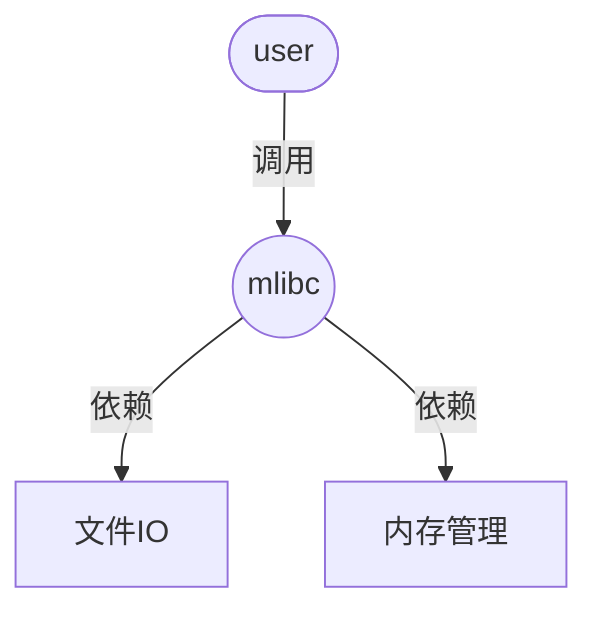

## 模块架构图

## 模块介绍

### 1. src

src目录中有三种类型的文件

- crt：存放c库的运行时初始化源文件
- internal：存放内部一些工具函数的头文件
- 存放其它标准函数的实现的源文件

### 2. include

include目录中有三种类型的文件

- sys：存放系统相关及系统调用接口相关的头文件
- arch：存放硬件接口相关的头文件（对应树状图中的arch_h）
  - 其中的generic文件夹用于存放不同架构之间的通用文件

- include（当前目录）：存放对外开放的接口，如stdio.h

> 注：generic存放各个硬件架构通用的一些文件

### 3. arch

存放不同架构对于一些硬件相关接口的实现

各个架构的硬件接口实现各占用一个文件夹

### 4. system

system目录中有三种类型的文件

- common：存放不同的系统的通用
- bare：裸机状态下的资源管理代码
- othersystem：在带有操作系统状态下的资源管理代码

## 系统调用接口

### 接口的设计思路

众所周知，接口就是我们用来获取系统资源的通道，而在mlibc中系统调用接口分为两种：**裸机接口和操作系统接口**。

裸机接口可能看着比较陌生，它其实就是将裸机状态下的一些资源抽象为系统资源了，我们仍然通过系统调用的方式去使用它，但实际它并没有系统管理。通过这种方式，我们不仅可以将硬件资源掌握在自己手里（按需修改资源管理代码），同时也能享受上层c库提供的一些方便好用的函数。

目前，我们只提供了两种类别的接口：**文件IO接口和内存管理接口**。

**文件IO接口提供的服务有：**

1. 打开文件
2. 关闭文件
3. 读文件
4. 写文件
5. 文件控制

**内存管理接口提供的服务有：**

1. 内存池初始化
2. 内存申请
3. 内存重申请
4. 内存释放

> 这里大家可能会有**疑问**：为什么裸机也要提供文件IO的服务呢？
>
> 实际上，裸机的文件IO函数基本都是空实现，并且都用了弱引用去声明它，这样的设计即可以防止上层文件IO相关的代码找不到定义，又能支持用户在有需要时去重定义这些实现，提高了c库在使用过程中的灵活性。
>
> 比如想要使用printf进行串口输出时，就可以通过重定义相关的接口去实现 -- 可以参考这篇[文章](https://blog.csdn.net/xuhuang11/article/details/119580130)。

### 内存管理接口

TODO

### 文件I/O接口

TODO

## 硬件接口

TODO
