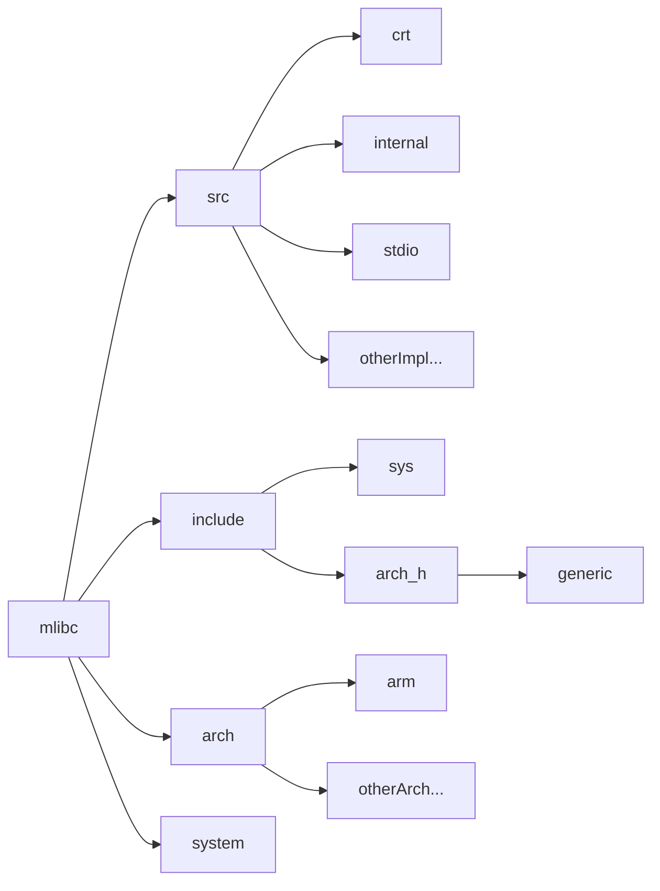
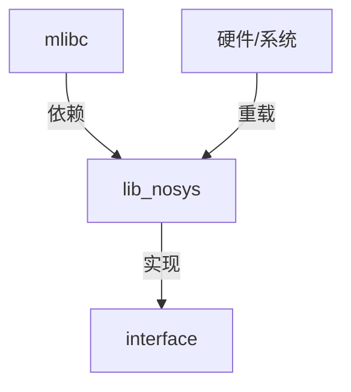

## 模块架构图

## 模块介绍

### 1. src

src目录中有三种类型的文件

- crt：存放c库的运行时初始化源文件
- internal：存放内部一些工具函数的头文件
- 存放其它标准函数的实现的源文件

### 2. include

include目录中有三种类型的文件

- sys：存放系统相关及系统调用接口相关的头文件
- arch：存放硬件接口相关的头文件（对应树状图中的arch_h）
  - 其中的generic文件夹用于存放不同架构之间的通用文件

- include（当前目录）：存放对外开放的接口，如stdio.h

> 注：generic存放各个硬件架构通用的一些文件

### 3. arch

存放不同架构对于一些硬件/系统相关接口的实现

各个架构的硬件接口实现各占用一个文件夹

## 系统调用接口

### 接口的设计思路

众所周知，接口就是我们用来获取系统资源的通道，mlibc通过这些接口来对上层提供服务。

接口默认是裸机实现，在不同系统/硬件的环境中通过重载这些接口来提供服务。

**文件IO接口提供的服务有：**

1. 打开文件
2. 关闭文件
3. 读文件
4. 写文件
5. 文件控制
6. ......

**内存管理接口提供的服务有：**

1. 堆区空间申请

> 这里大家可能会有**疑问**：为什么裸机也要提供文件IO的服务呢？
>
> 实际上，裸机的文件IO函数基本都是空实现，并且都用了弱引用去声明它，这样的设计即可以防止上层文件IO相关的代码找不到定义，又能支持用户在有需要时去重定义这些实现，提高了c库在使用过程中的灵活性。
>
> 比如想要使用printf进行串口输出时，就可以通过重定义相关的接口去实现 -- 可以参考这篇[文章](https://blog.csdn.net/xuhuang11/article/details/119580130)。

### 内存管理接口

TODO

### 文件I/O接口

TODO

## 硬件接口

TODO
