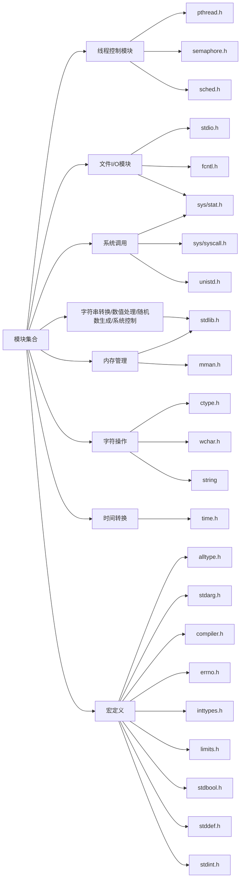
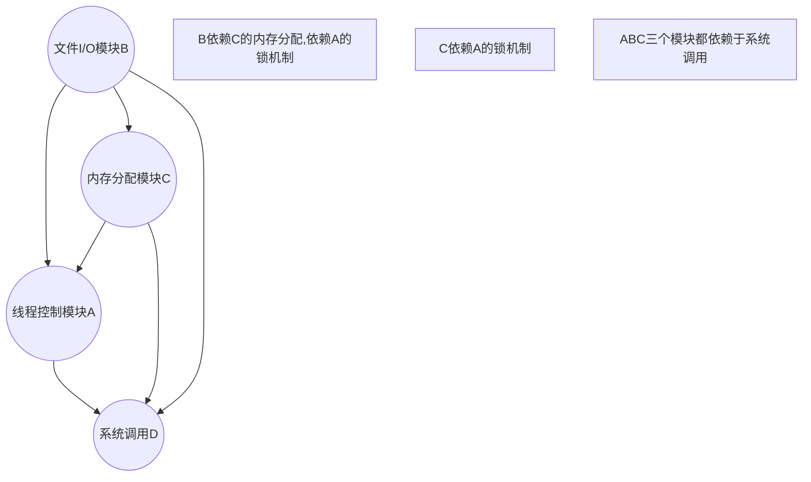

[TOC]

### 线程控制模块

**pthread.h**

**semaphore.h**

**sched.h**

### 文件输入/输出

**stdio.h**

**fcntl.h**

**sys/stat.h**

### **原子操作**

**未定义**

### 内存管理

**stdlib.h**

**mman.h**

### 字符串转换/数值处理/随机数生成/系统控制

**stdlib.h**

### 工具类

**stdlib.h**

**string.h**

**ctype.h**

**time.h**

**wchar.h**

### 宏定义

**alltype.h**

**stdarg.h**

**compiler.h**

**errno.h**

**inttypes.h**

**limits.h**

**stdbool.h**

**stddef.h**

**stdint.h**

### 系统调用

**sys/syscall.h**

**sys/stat.h**

**unistd.h**

### 模块树状图

### 模块之间的联系

> 箭头的指向为依赖关系，例：A-->B 为A依赖B

### 各个头文件包含的函数

> 实际开发可能会扩展出多个头文件

### ctype.h

| ctype.h | 函数名/宏定义 | 完成情况 |
| ------- | ------------- | -------- |
|         | isalnum()     | *        |
|         | isalpha()     | *        |
|         | isblank()     | *        |
|         | iscntrl()     | *        |
|         | isdigit()     | *        |
|         | isgraph()     | *        |
|         | islower()     | *        |
|         | isprint()     | *        |
|         | ispunct()     | *        |
|         | isspace()     | *        |
|         | isupper()     | *        |
|         | isxdigit()    | *        |
|         | tolower()     | *        |
|         | toupper()     | *        |

### errno.h

| [<errno.h>](https://pubs.opengroup.org/onlinepubs/9699919799/basedefs/errno.h.html) | 函数名/宏定义 | 完成情况     |
| ------------------------------------------------------------ | ------------- | ------------ |
|                                                              | errno         | 基本完成定义 |

### fcntl.h

| [<fcntl.h>](https://pubs.opengroup.org/onlinepubs/9699919799/basedefs/fcntl.h.html) | 函数名 | 完成情况 |
| ------------------------------------------------------------ | ------ | -------- |
|                                                              | open() | *        |

### fenv.h

| [<fenv.h>](https://pubs.opengroup.org/onlinepubs/9699919799/basedefs/fenv.h.html) | 函数名            | 完成情况 |
| ------------------------------------------------------------ | ----------------- | -------- |
|                                                              | feclearexcept()   |          |
|                                                              | fegetenv()        |          |
|                                                              | fegetexceptflag() |          |
|                                                              | fegetround()      |          |
|                                                              | feholdexcept()    |          |
|                                                              | feraiseexcept()   |          |
|                                                              | fesetenv()        |          |
|                                                              | fesetexceptflag() |          |
|                                                              | fesetround()      |          |
|                                                              | fetestexcept()    |          |
|                                                              | feupdateenv()     |          |

### inttypes.h

| [<inttypes.h>](https://pubs.opengroup.org/onlinepubs/9699919799/basedefs/inttypes.h.html) | 函数名      | 完成情况 |
| ------------------------------------------------------------ | ----------- | -------- |
|                                                              | imaxabs()   | *        |
|                                                              | imaxdiv()   | *        |
|                                                              | strtoimax() | *        |
|                                                              | strtoumax() | *        |

### local.h

| [<local.h>](https://pubs.opengroup.org/onlinepubs/9699919799/basedefs/locale.h.html) | 函数名       | 完成情况 |
| ------------------------------------------------------------ | ------------ | -------- |
|                                                              | localeconv() |          |
|                                                              | setlocale()  |          |

### pthread.h

| [<pthread.h>](https://pubs.opengroup.org/onlinepubs/9699919799/basedefs/pthread.h.html) | 函数名                             | 完成情况 |
| ------------------------------------------------------------ | ---------------------------------- | -------- |
|                                                              | pthread_attr_destroy()             |          |
|                                                              | pthread_attr_getdetachstate()      |          |
|                                                              | pthread_attr_getguardsize()        |          |
|                                                              | pthread_attr_getinheritsched()     |          |
|                                                              | pthread_attr_getschedparam()       |          |
|                                                              | pthread_attr_getschedpolicy()      |          |
|                                                              | pthread_attr_getscope()            |          |
|                                                              | pthread_attr_getstack()            |          |
|                                                              | pthread_attr_getstackaddr()        |          |
|                                                              | pthread_attr_getstacksize()        |          |
|                                                              | pthread_attr_init()                |          |
|                                                              | pthread_attr_setdetachstate()      |          |
|                                                              | pthread_attr_setguardsize()        |          |
|                                                              | pthread_attr_setinheritsched()     |          |
|                                                              | pthread_attr_setschedparam()       |          |
|                                                              | pthread_attr_setschedpolicy()      |          |
|                                                              | pthread_attr_setscope()            |          |
|                                                              | pthread_attr_setstack()            |          |
|                                                              | pthread_attr_setstackaddr()        |          |
|                                                              | pthread_attr_setstacksize()        |          |
|                                                              | pthread_cancel()                   |          |
|                                                              | pthread_cleanup_pop()              |          |
|                                                              | pthread_cleanup_push()             |          |
|                                                              | pthread_cond_broadcast()           |          |
|                                                              | pthread_cond_destroy()             |          |
|                                                              | pthread_cond_init()                |          |
|                                                              | pthread_cond_signal()              |          |
|                                                              | pthread_cond_timedwait()           |          |
|                                                              | pthread_cond_wait()                |          |
|                                                              | pthread_condattr_destroy()         |          |
|                                                              | pthread_condattr_getclock()        |          |
|                                                              | pthread_condattr_init()            |          |
|                                                              | pthread_condattr_setclock()        |          |
|                                                              | pthread_create()                   |          |
|                                                              | pthread_detach()                   |          |
|                                                              | pthread_equal()                    |          |
|                                                              | pthread_exit()                     |          |
|                                                              | pthread_getconcurrency()           |          |
|                                                              | pthread_getschedparam()            |          |
|                                                              | pthread_getspecific()              |          |
|                                                              | pthread_join()                     |          |
|                                                              | pthread_key_create()               |          |
|                                                              | pthread_key_delete()               |          |
|                                                              | pthread_mutex_destroy()            |          |
|                                                              | pthread_mutex_getprioceiling()     |          |
|                                                              | pthread_mutex_init()               |          |
|                                                              | pthread_mutex_lock()               |          |
|                                                              | pthread_mutex_setprioceiling()     |          |
|                                                              | pthread_mutex_trylock()            |          |
|                                                              | pthread_mutex_unlock()             |          |
|                                                              | pthread_mutexattr_destroy()        |          |
|                                                              | pthread_mutexattr_getprioceiling() |          |
|                                                              | pthread_mutexattr_getprotocol()    |          |
|                                                              | pthread_mutexattr_gettype()        |          |
|                                                              | pthread_mutexattr_init()           |          |
|                                                              | pthread_mutexattr_setprioceiling() |          |
|                                                              | pthread_mutexattr_setprotocol()    |          |
|                                                              | pthread_mutexattr_settype()        |          |
|                                                              | pthread_once()                     |          |
|                                                              | pthread_self()                     |          |
|                                                              | pthread_setcancelstate()           |          |
|                                                              | pthread_setcanceltype()            |          |
|                                                              | pthread_setconcurrency()           |          |
|                                                              | pthread_setschedparam()            |          |
|                                                              | pthread_setschedprio()             |          |
|                                                              | pthread_setspecific()              |          |
|                                                              | pthread_testcancel()               |          |
|                                                              | pthread_atfork()                   |          |
|                                                              | pthread_getcpuclockid()            |          |

### sched.h

| [<sched.h>](https://pubs.opengroup.org/onlinepubs/9699919799/basedefs/sched.h.html) | 函数名                   | 完成情况 |
| ------------------------------------------------------------ | ------------------------ | -------- |
|                                                              | sched_get_priority_max() |          |
|                                                              | sched_get_priority_min() |          |
|                                                              | sched_rr_get_interval()  |          |

### semaphore.h

| [<semaphore.h>](https://pubs.opengroup.org/onlinepubs/9699919799/basedefs/semaphore.h.html) | 函数名          | 完成情况 |
| ------------------------------------------------------------ | --------------- | -------- |
|                                                              | sem_close()     |          |
|                                                              | sem_destroy()   |          |
|                                                              | sem_getvalue()  |          |
|                                                              | sem_init()      |          |
|                                                              | sem_open()      |          |
|                                                              | sem_post()      |          |
|                                                              | sem_timedwait() |          |
|                                                              | sem_trywait()   |          |
|                                                              | sem_unlink()    |          |
|                                                              | [sem_wait()](   |          |

### setjmp.h

| [<setjmp.h>](https://pubs.opengroup.org/onlinepubs/9699919799/basedefs/setjmp.h.html) | 函数名    | 完成情况 |
| ------------------------------------------------------------ | --------- | -------- |
|                                                              | longjmp() |          |
|                                                              | setjmp()  |          |

### signal.h

| [<signal.h>](https://pubs.opengroup.org/onlinepubs/9699919799/basedefs/signal.h.html) | 函数名                | 完成情况 |
| ------------------------------------------------------------ | --------------------- | -------- |
|                                                              | kill()                |          |
|                                                              | pthread_kill()        |          |
|                                                              | pthread_sigmask() |          |
|                                                              | raise()               |          |
|                                                              | sigaction()           |          |
|                                                              | sigaddset()           |          |
|                                                              | sigdelset()           |          |
|                                                              | sigemptyset()         |          |
|                                                              | sigfillset()          |          |
|                                                              | sigismember()         |          |
|                                                              | signal()              |          |
|                                                              | sigpending()          |          |
|                                                              | sigprocmask()     |          |
|                                                              | sigqueue()            |          |
|                                                              | sigsuspend()          |          |
|                                                              | sigtimedwait()        |          |
|                                                              | sigwait()             |          |
|                                                              | sigwaitinfo()         |          |

### stdarg.h

| [<stdarg.h>](https://pubs.opengroup.org/onlinepubs/9699919799/basedefs/stdarg.h.html) | 函数名     | 完成情况 |
| ------------------------------------------------------------ | ---------- | -------- |
|                                                              | va_arg()   | *        |
|                                                              | va_copy()  | *        |
|                                                              | va_end()   | *        |
|                                                              | va_start() | *        |

### stdio.h

| [<stdio.h>](https://pubs.opengroup.org/onlinepubs/9699919799/basedefs/stdio.h.html) | 函数名             | 完成情况 |
| ------------------------------------------------------------ | ------------------ | -------- |
|                                                              | clearerr()         |          |
|                                                              | fclose()           |          |
|                                                              | fdopen()           |          |
|                                                              | feof()             |          |
|                                                              | ferror()           |          |
|                                                              | fflush()           |          |
|                                                              | fgetc()            |          |
|                                                              | fgets()            |          |
|                                                              | fileno()           |          |
|                                                              | flockfile()        |          |
|                                                              | fopen()            |          |
|                                                              | fprintf()          |          |
|                                                              | fputc()            |          |
|                                                              | fputs()            |          |
|                                                              | fread()            |          |
|                                                              | freopen()          |          |
|                                                              | fscanf()           |          |
|                                                              | ftrylockfile()     |          |
|                                                              | funlockfile()      |          |
|                                                              | fwrite()           |          |
|                                                              | getc()             |          |
|                                                              | getc_unlocked()    |          |
|                                                              | getchar()          |          |
|                                                              | getchar_unlocked() |          |
|                                                              | gets()             |          |
|                                                              | perror()           |          |
|                                                              | printf()           |          |
|                                                              | putc()             |          |
|                                                              | putc_unlocked()    |          |
|                                                              | putchar()          |          |
|                                                              | putchar_unlocked() |          |
|                                                              | puts()             |          |
|                                                              | scanf()            |          |
|                                                              | setbuf()           |          |
|                                                              | setvbuf()          |          |
|                                                              | snprintf()         |          |
|                                                              | sprintf()          |          |
|                                                              | sscanf()           |          |
|                                                              | stderr             | *        |
|                                                              | stdin              | *        |
|                                                              | stdout             | *        |
|                                                              | ungetc()           |          |
|                                                              | vfprintf()         | *        |
|                                                              | vfscanf()          |          |
|                                                              | vprintf()          |          |
|                                                              | vscanf()           |          |
|                                                              | vsnprintf()        |          |
|                                                              | vsprintf()         |          |
|                                                              | vsscanf()          |          |

### string.h

| [<string.h>](https://pubs.opengroup.org/onlinepubs/9699919799/basedefs/string.h.html) |              |      |
| ------------------------------------------------------------ | ------------ | ---- |
|                                                              | memchr()     |      |
|                                                              | memcmp()     |      |
|                                                              | memcpy()     |      |
|                                                              | memmove()    |      |
|                                                              | memset()     |      |
|                                                              | strcat()     |      |
|                                                              | strchr()     |      |
|                                                              | strcmp()     |      |
|                                                              | strcoll()    |      |
|                                                              | strcpy()     |      |
|                                                              | strcspn()    |      |
|                                                              | strerror()   |      |
|                                                              | strerror_r() |      |
|                                                              | strlen()     |      |
|                                                              | strncat()    |      |
|                                                              | strncmp()    |      |
|                                                              | strncpy()    |      |
|                                                              | strpbrk()    |      |
|                                                              | strrchr()    |      |
|                                                              | strspn()     |      |
|                                                              | strstr()     |      |
|                                                              | strtok()     |      |
|                                                              | strtok_r()   |      |
|                                                              | strxfrm()    |      |

### mman.h

| [mman.h](https://pubs.opengroup.org/onlinepubs/9699919799/basedefs/sys_mman.h.html) | 函数名       |      |
| ------------------------------------------------------------ | ------------ | ---- |
|                                                              | mlockall()   |      |
|                                                              | mmap()       |      |
|                                                              | munlock()    |      |
|                                                              | munmap()     |      |
|                                                              | shm_open()   |      |
|                                                              | shm_unlink() |      |

### uname.h

| [uname.h](https://pubs.opengroup.org/onlinepubs/9699919799/basedefs/sys_utsname.h.html) | 函数名  | 完成情况 |
| ------------------------------------------------------------ | ------- | -------- |
|                                                              | uname() |          |

### time.h

| [time.h](https://pubs.opengroup.org/onlinepubs/9699919799/basedefs/time.h.html) | 函数名             | 完成情况 |
| ------------------------------------------------------------ | ------------------ | -------- |
|                                                              | asctime()          |          |
|                                                              | asctime_r()        |          |
|                                                              | clock_getres()     |          |
|                                                              | clock_gettime()    |          |
|                                                              | clock_nanosleep()  |          |
|                                                              | clock_settime()    |          |
|                                                              | ctime()            |          |
|                                                              | ctime_r()          |          |
|                                                              | difftime()         |          |
|                                                              | gmtime()           |          |
|                                                              | gmtime_r()         |          |
|                                                              | localtime()        |          |
|                                                              | localtime_r()      |          |
|                                                              | nanosleep()        |          |
|                                                              | strftime()         |          |
|                                                              | time()             |          |
|                                                              | timer_create()     |          |
|                                                              | timer_delete()     |          |
|                                                              | timer_getoverrun() |          |
|                                                              | timer_gettime()    |          |
|                                                              | timer_settime()    |          |
|                                                              | tzname             |          |
|                                                              | tzset()            |          |

### unistd.h

| [unistd.h](https://pubs.opengroup.org/onlinepubs/9699919799/basedefs/unistd.h.html) | 函数名/宏   | 完成情况                       |
| ------------------------------------------------------------ | ----------- | ------------------------------ |
|                                                              | alarm()     |                                |
|                                                              | close()     | *(直接调用系统提供的posix接口) |
|                                                              | environ     |                                |
|                                                              | fdatasync() |                                |
|                                                              | fsync()     |                                |
|                                                              | pause()     |                                |
|                                                              | read()      | *(直接调用系统提供的posix接口) |
|                                                              | sysconf()   |                                |
|                                                              | write()     | *(直接调用系统提供的posix接口) |
|                                                              | confstr()   |                                |
