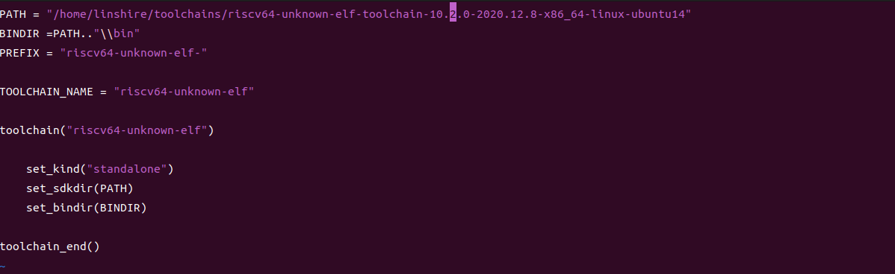

[English](README.md) | **中文** 

# Embedded libc 

Embedded libc，一个为嵌入式系统和裸机适配的libc库

## Mlibc特性

+ 低资源占用
+ OpenSource
+ Especially for RISC-V..

## 目录

|    目录    |          详解           |
| :--------: | :---------------------: |
|    arch    | 对不同cpu架构的支持文件 |
|   figure   |  README.md中的图片存储  |
|  include   |       头文件存放        |
|    src     |        源码文件         |
| toolchains |     工具链支持文件      |


## 背景


# Why we do

## 我们的期望

 ● mlibc可以支持到多种嵌入式工具链，能够使用gcc(arm/risc-v)、甚至LLVM等编译器

● 为小资源系统设计，完美地支持到一些嵌入式实时操作系统（RT-Thread等）和裸机

● 针对risc-v 32/64进行优化，能够适配主流的一些RISC-V MCU

● 采用xmake和scons构建

● reserve


## 我们的计划


● 使用QEMU/RISC-V 32GC模拟主机方式，输出第一个hello word

● 针对裸机版本的mlibc，加入最基础的crt.s，string，printf函数

● 基于此环境，完善mlibc


# 快速上手

1. 下载安装xmake，这里给出了xmake发行版本的 [地址](https://github.com/xmake-io/xmake/releases) ,同时具有windows以及linux版本，按需安装即可

   

2. clone mlibc源码到本地，地址在[这里](https://github.com/plctlab/mlibc) ，使用如下命令，并等待clone完成

    

   ```
   git clone git@github.com:plctlab/mlibc.git
   ```

   

3. 在mlibc根目录下，打开toolchains文件夹并编辑配置文件，只需要调整编译器路径


只需要更改PATH=后的路径，笔者的路径如下



4. 在命令行输入xmake，等待编译完成

   

5. 这时在mlibc文件夹下会有一个mlibc文件夹，即mlibc/mlibc/,里面所需要的头文件，编译好的libmlibc.a静态库文件，以及Sconscript文件（为了支持RT-Thread的scons构建系统），用户只需要将mlibc文件夹复制到自己的工程即可


# 贡献代码

+ How to

  1. Fork 本仓库

  1. 新建 Feat_xxx 分支

  1. 提交代码

  1. 新建 Pull Request


# 许可协议

mlibc完全开源，遵循MIT协议，允许商用和随意修改，可以放心使用，仅仅需要在软件中声明使用的是MIT协议，没有潜在的商业风险。


